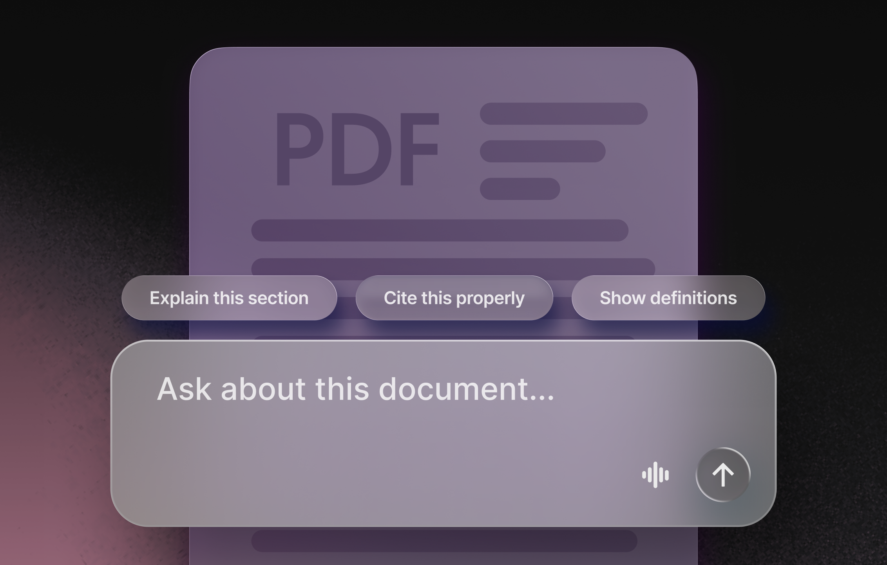

# Chat with PDF

An AI-powered PDF assistant that lets you chat with any PDF document. Ask questions about the content, get answers with page citations, and optionally generate quizzes to test your comprehension. Uses RAG (Retrieval-Augmented Generation) to find relevant passages and provide accurate, sourced answers. Built with [Mastra](https://mastra.ai).

## Why we built this

Putting an entire PDF in a context window hits token limits, wastes money on irrelevant tokens, and causes context drift—where the model loses focus as it wades through pages of text that don't matter. RAG solves this: the PDF gets chunked into vector embeddings, and when you ask a question, only the most relevant chunks are included in the prompt. This keeps your costs down, avoids context limits, and gives the model focused context for better answers.

This template shows how Mastra's RAG capabilities, vector storage, and agent workflows fit together—and gives you a starting point to build your own document chat experience.

## Demo

https://github.com/user-attachments/assets/a3731ef5-a531-4f56-8695-8d05b7f81024

This demo runs in Mastra Studio, but you can connect this agent to your React, Next.js, or Vue app using the [Mastra Client SDK](https://mastra.ai/docs/server/mastra-client) or agentic UI libraries like [AI SDK UI](https://mastra.ai/guides/build-your-ui/ai-sdk-ui), [CopilotKit](https://mastra.ai/guides/build-your-ui/copilotkit), or [Assistant UI](https://mastra.ai/guides/build-your-ui/assistant-ui).

## Features

- **No token limits**: chat with 500-page textbooks as easily as a 5-page memo
- **Page citations**: every answer references its source pages so you can verify
- **Quiz generation**: active recall quizzes generated from your actual content

## Quick start

1. **Clone the template**
   - Run `npx create-mastra@latest --template chat-with-pdf` to scaffold the project locally.
2. **Add your API key**
   - Copy `.env.example` to `.env` and fill in your OpenAI API key.
3. **Start the dev server**
   - Run `npm run dev` and open [localhost:4111](http://localhost:4111) to try it out.

Open Studio and start chatting with the PDF agent. Provide a PDF URL to index it, then ask questions about the content or request a quiz on specific pages or topics. The agent searches the indexed content, answers questions with page citations, and can generate comprehension quizzes from actual passages.

> Need a PDF to try? Grab our free book, [Principles of Building AI Agents](https://mastra.ai/books/principles-of-building-ai-agents).

## Making it yours

Swap in a different embedding model, adjust the chunking strategy, or wire the agent into your app using the [Mastra Client SDK](https://mastra.ai/docs/server/mastra-client). You can also swap out LibSQL for another vector database — Mastra supports [many options](https://mastra.ai/docs/storage/vector-databases) including Pinecone, Qdrant, Chroma, pgvector, and more. The agent, tools, and workflow are all in `src/` — edit them directly to fit your use case.

## About Mastra templates

[Mastra templates](https://mastra.ai/templates) are ready-to-use projects that show off what you can build — clone one, poke around, and make it yours. They live in the [Mastra monorepo](https://github.com/mastra-ai/mastra) and are automatically synced to standalone repositories for easier cloning.

Want to contribute? See [CONTRIBUTING.md](./CONTRIBUTING.md).
